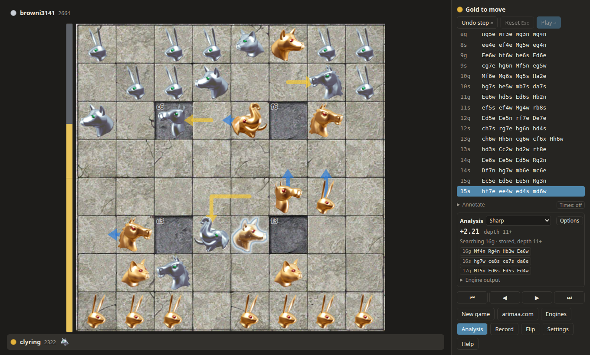

# Howdah 

[](https://github.com/Janzert/howdah/actions/workflows/ci.yml)

Howdah is a desktop app for playing and studying
[Arimaa](https://en.wikipedia.org/wiki/Arimaa). Play against engines on
your own computer, analyse positions, keep annotated game records, and
play or watch games on [arimaa.com](http://arimaa.com/). It runs on
Windows, Linux and macOS.



## Features

**Play and review**

- The complete rules, including repetition and the one-minute setup
  allowance in timed games.
- Move pieces by dragging them along their route, with arrows on hover,
  or step by step with the mouse. Moves animate, and frozen pieces are
  marked.
- A move tree with variations, comments and move glyphs. Try a line
  anywhere in a game, and it's kept as a variation.
- Load and copy game records in the PGN-style Arimaa format, including
  games from the arimaa.com archive.
- Clocks and time controls, sounds, board and piece themes, and light
  and dark colors.

**Engines**

- Play against an engine, or watch two engines play each other.
- [Sharp](https://github.com/Janzert/arimaasharp) and
  [OpFor](https://github.com/Janzert/OpFor) can be installed from the
  Engines dialog with a click, and kept up to date there. Any other
  engine that speaks [AEI](https://github.com/Janzert/AEI) can be added
  by its program path or a manifest.
- Set an engine's options for every game, for one game, or for analysis.

**Analysis**

- An engine searches the position on the board as you move through a
  game, showing its evaluation, its best line on the board, and its
  output. Click a line to add it to the game as a variation.

**arimaa.com**

- Log in to the gameroom to watch live games or open finished ones.
- Play: create and join games, rated or unrated, live or postal, with
  invitations, chat and takebacks.
- Games carry on through network drops and the computer sleeping, and
  you can return to a game in progress.

## Install

Download the installer for your system from the
[latest release](https://github.com/Janzert/howdah/releases/latest):

| System | File |
| --- | --- |
| Windows 10 and 11 (x64) | `Howdah_<version>_x64-setup.exe`, or the `.msi` |
| macOS (Apple Silicon) | `Howdah_<version>_aarch64.dmg` |
| Linux (x86_64) | `.deb` (Debian, Ubuntu), `.rpm` (Fedora, RHEL), or `.AppImage` (any distribution) |

The installers aren't code signed yet, so your system will warn you the
first time you start Howdah:

- **Windows:** SmartScreen says it protected your PC. Click
  *More info*, then *Run anyway*.
- **macOS:** after macOS refuses to open it, open System Settings,
  go to *Privacy & Security*, and click *Open Anyway* next to Howdah.
  If macOS says the app is damaged, run
  `xattr -dr com.apple.quarantine /Applications/Howdah.app` in Terminal.
  (The macOS build is tested automatically but hasn't yet been tried by
  hand. Reports are welcome.)
- **Linux:** for the AppImage, make it executable first
  (`chmod +x Howdah_*.AppImage`) and then run it. It needs WebKitGTK 4.1
  (`libwebkit2gtk-4.1-0` on Debian and Ubuntu, `webkit2gtk4.1` on
  Fedora), which most desktops already have. The `.deb` and `.rpm`
  install it for you.

The release's `SHA256SUMS` file lists each download's SHA-256 digest if
you'd like to check it.

Howdah doesn't update itself. The [releases page](https://github.com/Janzert/howdah/releases)
has new versions, and [CHANGELOG.md](CHANGELOG.md) what changed.

### Troubleshooting

- **Linux, blank window:** on some NVIDIA or Wayland setups, start it
  with `WEBKIT_DISABLE_DMABUF_RENDERER=1 howdah` (or put the variable in
  front of the AppImage).
- **Linux, no sound:** sound goes through GStreamer; install
  `gstreamer1.0-plugins-good` (Debian, Ubuntu) or
  `gstreamer1-plugins-good` (Fedora).

## Getting started

- **Play an engine:** open *Engines* and install Sharp or OpFor, then
  start a *New game* with the engine on one side.
- **Analyse:** turn on *Analysis* and pick an engine. It follows the
  position as you step through the game.
- **arimaa.com:** click *arimaa.com* and log in with your gameroom
  account to play, watch, or start games.
- **Records:** *Record* loads a game pasted in or opened from a file,
  and gives the current game's record to copy.
- Press `?` for the keyboard shortcuts.

## Building from source

Howdah is written in Rust with [Tauri 2](https://tauri.app/) and a
Svelte and TypeScript frontend.

### Prerequisites

- Rust (stable, 1.90+) and Node.js 22.12+ (or 24+) with npm.
- The platform packages Tauri needs:

**Linux**

Debian/Ubuntu:
```bash
sudo apt install libwebkit2gtk-4.1-dev build-essential curl wget file libxdo-dev libssl-dev libayatana-appindicator3-dev librsvg2-dev
```

Fedora: `sudo dnf install webkit2gtk4.1-devel openssl-devel libappindicator-gtk3-devel librsvg2-devel libxdo-devel`
plus `sudo dnf group install c-development`.

The app itself only strictly needs `libwebkit2gtk-4.1-dev` and a C
toolchain; the rest are for bundling.

**Windows**: Microsoft C++ Build Tools ("Desktop development with C++")
and WebView2, which ships with Windows 10/11.

**macOS**: Xcode Command Line Tools (`xcode-select --install`).

### Build and run

```bash
cd app
npm install
npm run tauri dev      # run the app with hot reload
npm run tauri build    # installers, in target/release/bundle/
```

### Test

```bash
cargo test --workspace                   # Rust: rules, engines, gameroom client, app logic
cargo clippy --workspace --all-targets
cd app
npm run check                            # svelte-check / TypeScript
npm test                                 # vitest
npm run e2e                              # Playwright smoke tests (needs Chromium)
```

CI runs these on Linux, Windows and macOS and builds the installers.

### Layout

- `crates/howdah-arimaa`: rules, positions, notation, the game tree and
  game records. Pure Rust with no UI dependencies.
- `crates/howdah-aei`: an async AEI controller and engine-vs-engine matches.
- `crates/howdah-gameroom`: the arimaa.com gameroom client.
- `app/`: the Tauri application. `src-tauri/` is the Rust shell and `src/`
  is the Svelte frontend.
- `docs/`: design notes (analysis, variations, engines, the gameroom,
  result codes).

## Acknowledgements

The classic board and piece images come from the original arimaa.com
client and have been released to the public domain. See
`app/src/themes/classic/ATTRIBUTION.md`.

The sounds are made from samples in [Kenney](https://kenney.nl/)'s audio
packs (Interface Sounds, Casino Audio, Impact Sounds, Music Jingles, UI
Audio and Digital Audio), released under CC0. Thanks, Kenney! See
`app/src/sounds/board/ATTRIBUTION.md` and
`app/src/sounds/app/ATTRIBUTION.md` for which samples went into which
sound.

Finally, thanks to Omar Syed, not only for creating a great game but even
more for his decades of effort keeping [arimaa.com](http://arimaa.com/) alive
and working for players to enjoy.

## License

MIT; see [LICENSE](LICENSE).
